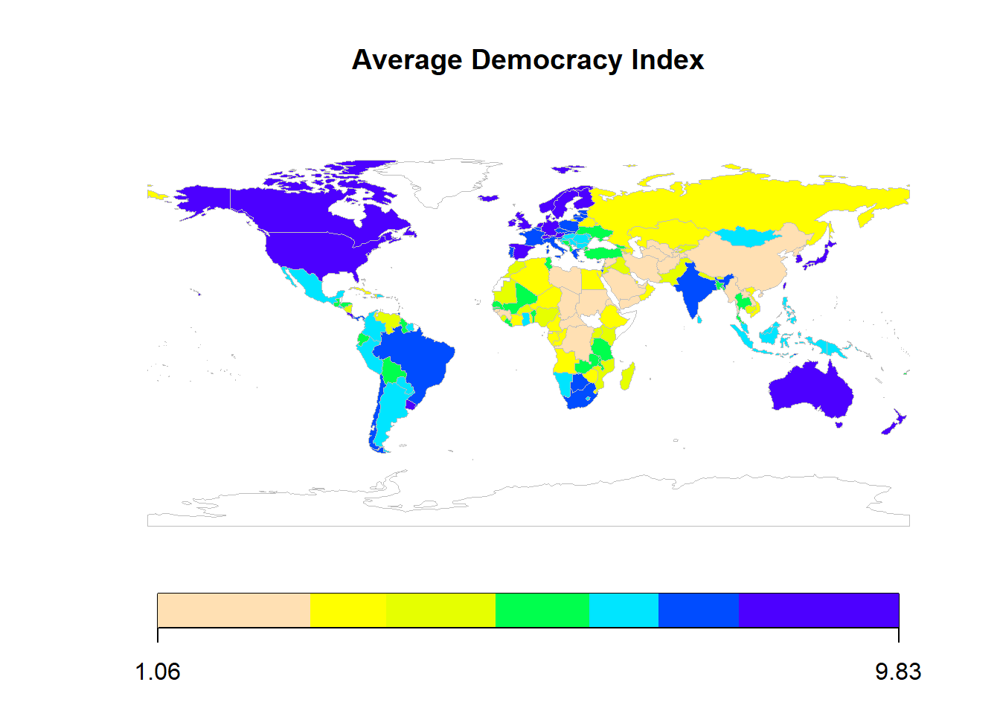
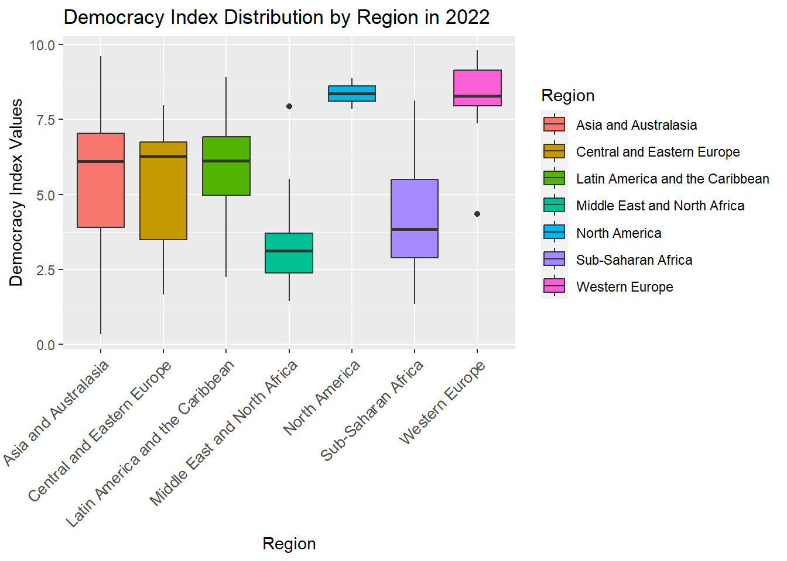
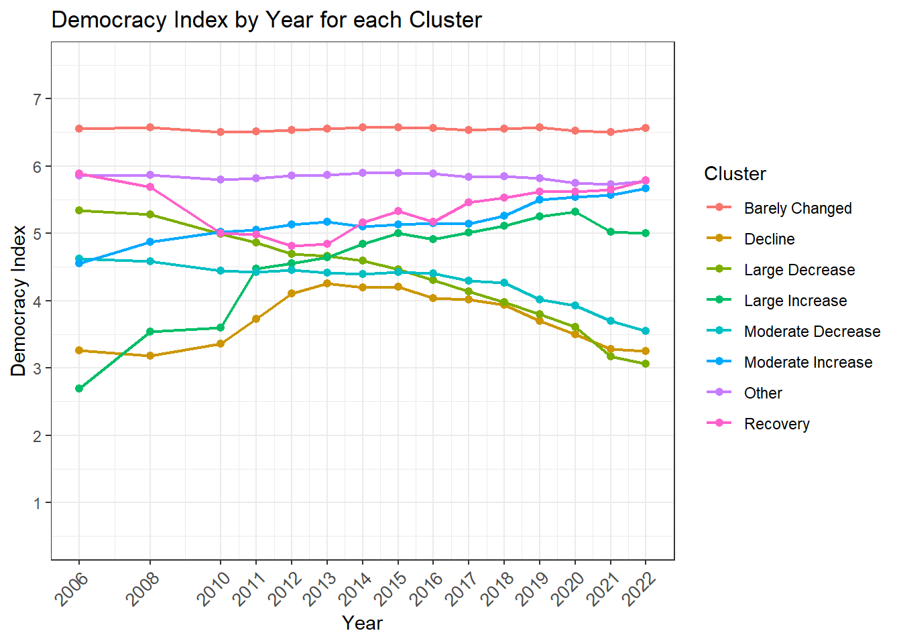
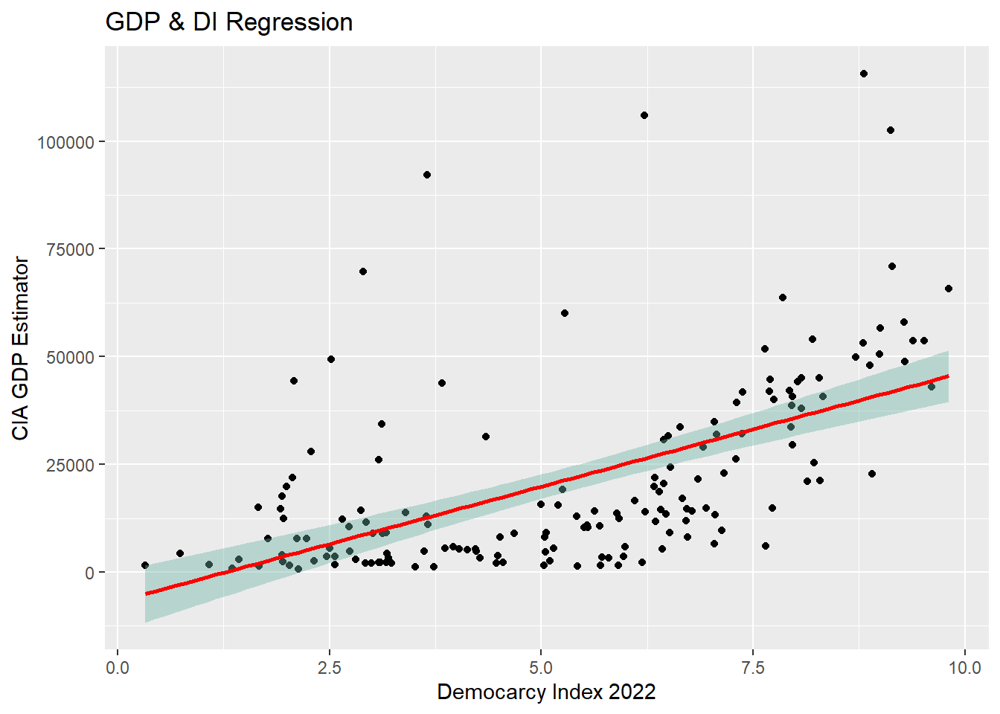
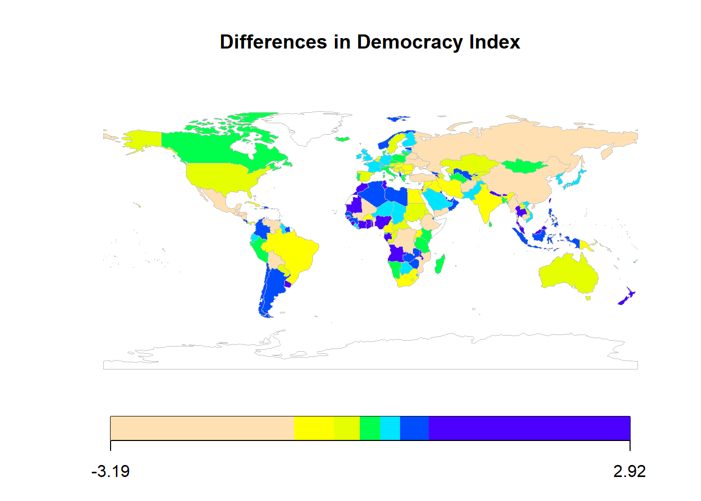

# Democracy Index Analysis

An R analysis of the Economist Intelligence Unit's **Democracy Index** for 167 countries from 2006 to 2022. It looks at how democracy differs between regions, which countries rose or fell, how often countries move between regime types, and how democracy relates to GDP, incarceration, population and land area. The data is scraped from Wikipedia and combined from five tables.

**[View the full report →](https://idoshalom1997.github.io/Democracy-Index-Analysis/)**



## Key findings

- **Democracy is declining overall.** Between 2006 and 2022 most countries' scores went down. Sub-Saharan Africa is the main exception.
- **Regions differ strongly.** Western Europe and North America score highest; the Middle East & North Africa and Sub-Saharan Africa score lowest. Asia & Australasia varies the most.
- **Richer countries tend to be more democratic.** Each extra point of Democracy Index is associated with about **$5,300 more GDP per capita** (PPP, R² = 0.33, p < 0.001).
- **No link with incarceration.** The incarceration rate shows no relationship with the Democracy Index (p = 0.79).
- **Not all components matter equally.** Of the index's five components, *functioning of government* and *political culture* are the strongest positive predictors of GDP.

| Distribution by region (2022) | Countries grouped by their 2006-2022 trend |
|:---:|:---:|
|  |  |
| **Democracy Index vs GDP per capita** | **Change in Democracy Index, 2006 → 2022** |
|  |  |

## What's in the analysis

1. **Data collection and cleaning:** scraping and cleaning the index, regional and component tables from Wikipedia.
2. **Distributions by region:** boxplots, density plots, mean, variance, skewness and kurtosis.
3. **Trends:** country and region time series, and grouping countries into 8 trend clusters (large increase, recovery, decline, barely changed, and so on).
4. **Regime transitions:** the estimated probability of moving between *full democracy*, *flawed democracy*, *hybrid regime* and *authoritarian* from 2006 to 2022.
5. **Joining external data:** GDP (PPP) per capita, incarceration rate, population and area, merged by country, with linear regressions.
6. **Empirical CDFs:** the GDP distribution weighted by country, by population and by land area, and how the quantiles shift.
7. **World maps** of the average index and of the change since 2006.
8. **Index components:** the correlation matrix and a multiple regression of GDP on the five components, with the largest residuals.

## How to run

You need R (4.2 or newer) with these packages:

```r
install.packages(c("tidyverse", "data.table", "rworldmap", "ggthemes", "reshape2",
                   "e1071", "rvest", "corrplot", "moments", "spatstat.geom", "rmarkdown"))
```

Then build the report:

```r
rmarkdown::render("democracy_index.Rmd")
```

The Wikipedia pages are read **as they were in May-June 2023**, so the results always match the original analysis even though Wikipedia keeps changing.

## Tools

R · tidyverse (dplyr, ggplot2, tidyr) · rvest for web scraping · rworldmap · corrplot · R Markdown

## Background

Written in May-June 2023 by **Ido Shalom and Daniel Rodan** for the *Data Analysis with R* course at the Hebrew University of Jerusalem (B.Sc. Statistics & Data Science).
